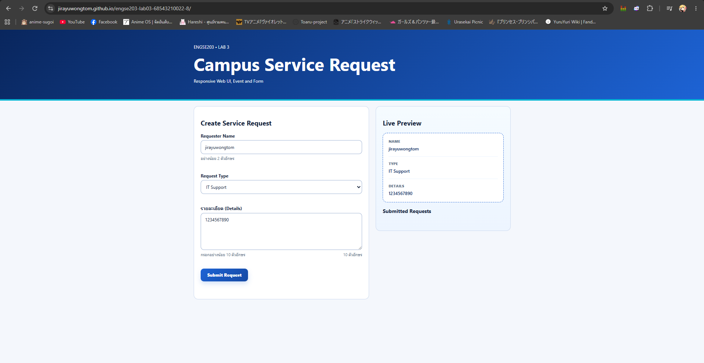
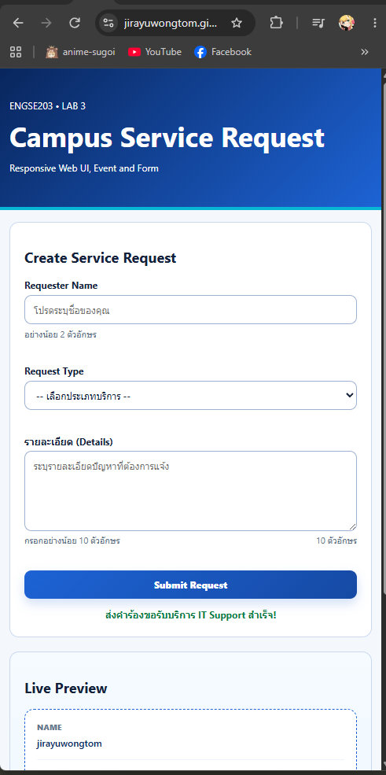
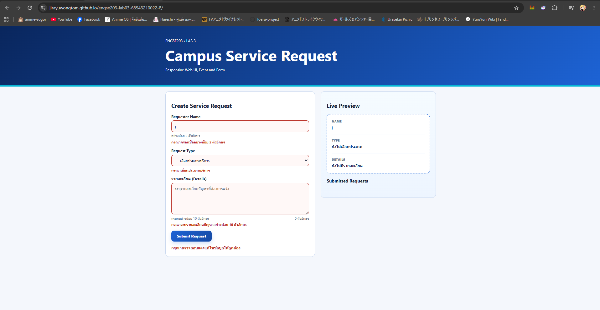
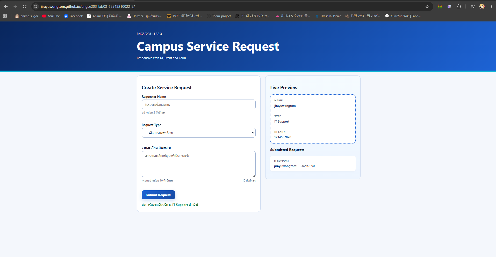

# ENGSE203 LAB 03 — Responsive Web UI & Form Interaction

## ผู้จัดทำ

- ชื่อ-นามสกุล: จิรายุ วงศ์ต่อม
- รหัสนักศึกษา: 68543210022-8
- ระบบปฏิบัติการที่ใช้: Windows (WSL)
- GitHub Pages URL: https://jirayuwongtom.github.io/engse203-lab03-68543210022-8/

## วัตถุประสงค์ของงาน

- เพื่อฝึกทักษะการสร้างหน้าเว็บแบบ Responsive Layout ที่รองรับทั้งมือถือและคอมพิวเตอร์
- เพื่อทำความเข้าใจการเขียนโครงสร้างหน้าเว็บด้วย Semantic HTML และการเชื่อมโยง Accessibility
- เพื่อฝึกฝนการใช้งาน JavaScript ในการจัดการ Event สำหรับทำ Live Preview และตรวจสอบข้อมูล

## เครื่องมือที่ใช้

- Git และ GitHub
- Command Line (WSL)
- Visual Studio Code
- Node.js / npm
- npm
- JavaScript
- Vite / GitHub Pages
- HTML5 / CSS3

## วิธีติดตั้งและรัน

```bash
# ติดตั้ง dependency
npm install
# ตั้งค่า Vite สำหรับ GitHub Pages
# เปิด vite.config.js แล้วเปลี่ยนค่าชื่อ repository ให้ตรงกับของตนเอง
# ตรวจและรันในเครื่อง
npm run check
npm run dev
# ทดสอบ build
npm run build
npm run preview
```

## โครงสร้างไฟล์

```text
engse203-lab03-68543210022-8/
├── docs/
├── image/
├── src/
│   ├── main.js
│   └── style.css
├── .gitignore
├── index.html
├── package-lock.json
├── package.json
├── README.md
└── vite.config.js
```

## หลักฐานผลลัพธ์

**1. หน้าจอ Desktop และการทำงานของ Live Preview:**


**2. การแสดงผลบนหน้าจอมือถือ (Responsive Layout):**


**3. ระบบตรวจสอบข้อมูลไม่ถูกต้อง (Error State):**


**4. เมื่อส่งข้อมูลสำเร็จและแสดงรายการ (Success State):**


## ปัญหาที่พบและวิธีแก้ไข

- ปัญหา :
- วิธีแก้ :

## References & AI Assistance

- Source / Documentation :
  - https://github.com/se-rmutl/engse203-lab/tree/main/labs/week-03-responsive-ui
  - https://github.com/se-rmutl/engse203-lab/blob/main/labs/week-03-responsive-ui/lab3/INSTRUCTOR_GRADING_CHECKLIST.md
- AI tool used : Gemini
- Used for : ตรวจสอบความถูกต้องของโค้ดตาม Checklist
- My adaptation :
